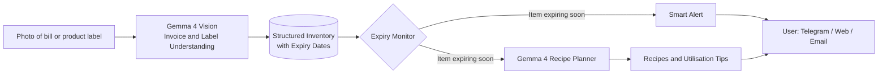
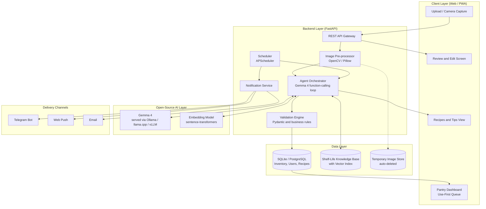
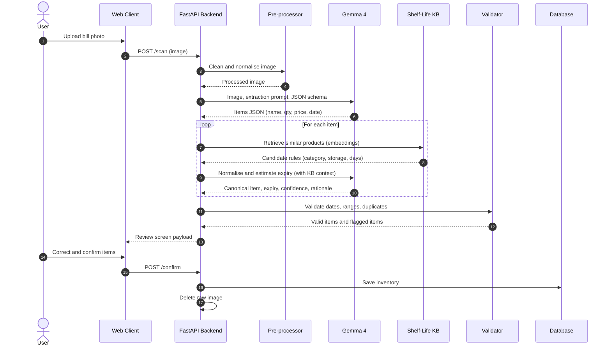
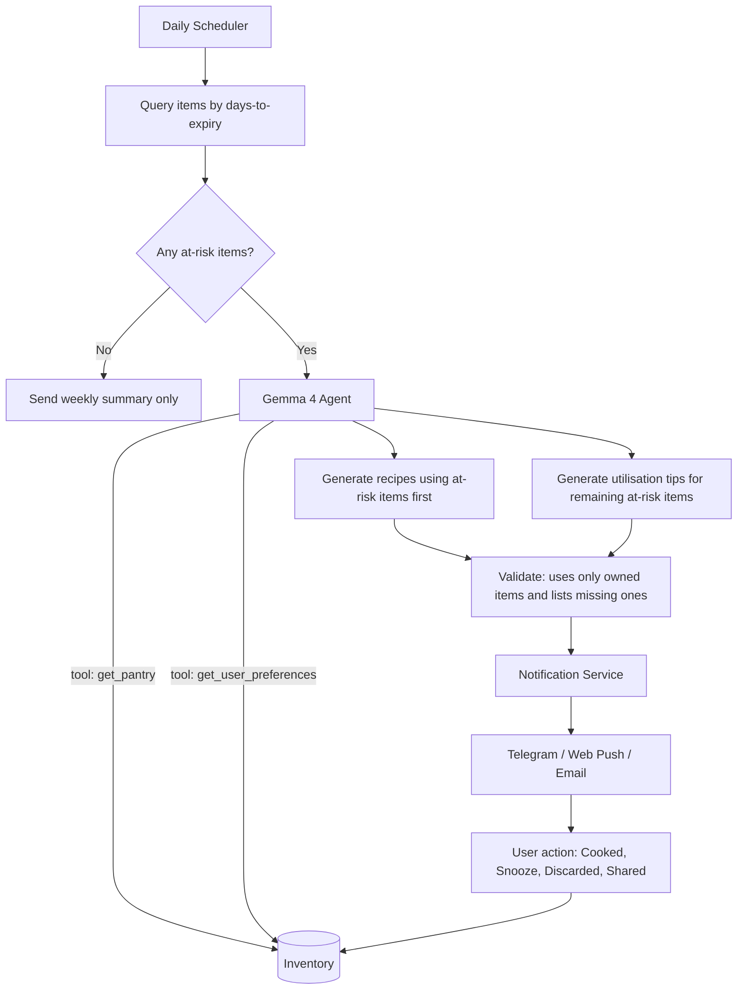
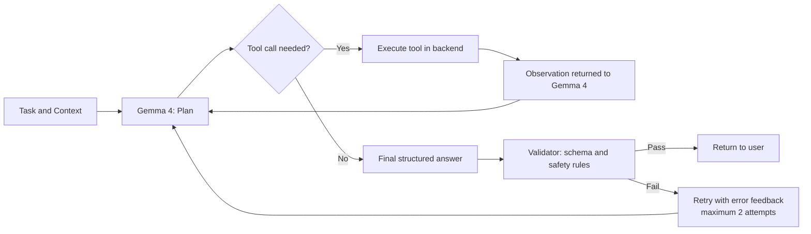

# FreshLedger

### AI-Powered Pantry and Expiry Intelligence System

**Hacktober Fest | Open Source AI Hackathon — Qualifier Round Technical Proposal**

| | |
|---|---|
| **Team Name** | D3ADcode |
| **Team Size** | 2 |
| **Participant** | 1. Tejas Fuse 2. Darshan Lahase |
| **GitHub** | 1. [tejas-fuse](https://github.com/tejas-fuse) 2. [lahasedarshan-01](https://github.com/lahasedarshan-01) |
| **Email** | 1. tejasfuse343.caption@gmail.com 2. lahasedarshan@gmail.com |
| **Phone** | 1. +91 94235 91941 2. +91 96372 39930 |
| **Selected Track** | Best Use of Gemma 4 / Gemma 4 Open-Source |
| **Core Technology** | Google Gemma 4 (open-weight, Apache 2.0) |
| **Organizer** | Elevate (Powered by MLH and DEV) |
| **Document Status** | Qualifier submission — README-only proposal (no implementation code) |

---

## Table of Contents

1. [Project Name](#1-project-name)
2. [Problem Statement](#2-problem-statement)
3. [Project Overview](#3-project-overview)
4. [Proposed Solution](#4-proposed-solution)
5. [Objectives](#5-objectives)
6. [Target Users / Use Case](#6-target-users--use-case)
7. [Open-Source AI Technology Selected](#7-open-source-ai-technology-selected)
8. [Why This Technology Was Selected](#8-why-this-technology-was-selected)
9. [AI's Role in the System](#9-ais-role-in-the-system)
10. [System Architecture](#10-system-architecture)
11. [Component-Level Architecture](#11-component-level-architecture)
12. [Data / Information Flow](#12-data--information-flow)
13. [Agentic Workflow](#13-agentic-workflow)
14. [Technology Stack](#14-technology-stack)
15. [Expected Features](#15-expected-features)
16. [Implementation Approach](#16-implementation-approach)
17. [Expected Final Output](#17-expected-final-output)
18. [Future Scope / Scalability](#18-future-scope--scalability)
19. [Open-Source Dependencies / Components](#19-open-source-dependencies--components)
20. [Expected Challenges and Mitigation](#20-expected-challenges-and-mitigation)

---

## 1. Project Name

**FreshLedger** — an AI-powered pantry and expiry intelligence system.

| Item | Detail |
|---|---|
| Tagline | Scan a bill once. Waste less food. |
| Team | D3ADcode (individual participant: Tejas Fuse) |
| Hackathon Track | Best Use of Gemma 4 / Gemma 4 Open-Source |
| Core Model | Google Gemma 4 (open-weight, Apache 2.0) |
| Planned Project License | Apache 2.0 (for the final-round source code) |
| Planned Domain | `freshledger.tech` (using the free .tech domain perk) |

---

## 2. Problem Statement

Households purchase groceries in bulk but rarely track what is approaching expiry. Items are forgotten in the refrigerator or pantry and discarded after spoilage, resulting in financial loss, food waste, and avoidable environmental impact.

Existing solutions share one weakness: **manual data entry**.

| Existing Approach | Limitation |
|---|---|
| Manual pantry / inventory applications | Entering 20–40 items after every shopping trip is tedious; usage typically stops within days. |
| Barcode-scanning applications | Item-by-item scanning is slow, and many local or unpackaged products have no barcode record. |
| Generic recipe applications | Suggestions are based on what the user types, not on what is at home and about to spoil. |
| Calendar / reminder applications | The user must still remember and enter every date, and reminders are not linked to what can be cooked. |

Two further technical difficulties make this a genuine engineering problem rather than a simple model wrapper:

1. **A purchase bill generally does not list expiry dates.** The bill states what was bought and when; the expiry or best-before date is printed on the package. A useful system must combine bill data, label data, and reasoned shelf-life estimation.
2. **Bills are highly inconsistent.** Supermarket GST invoices, quick-commerce order summaries, thermal-paper receipts, and handwritten shop bills differ widely in layout, abbreviations, and language.

**Core question:** *Given a photograph of a grocery bill (and optionally a few product labels), can an AI system determine what the user owns, when each item will expire, what should be used first, and what can be cooked with it?*

---

## 3. Project Overview

FreshLedger converts a grocery purchase into a continuously updated pantry. The user photographs or uploads a purchase bill. A locally hosted **Gemma 4** model reads the image directly, extracts line items, normalises product names, estimates or reads expiry information, and stores everything as structured inventory. The system then:

- ranks items by urgency in a "use-first" queue,
- sends alerts before items expire,
- suggests recipes built around the ingredients nearing expiry, and
- recommends utilisation strategies (freeze, dry, pickle, share) for items that cannot be cooked in time.

**Fit with the selected track:** every significant stage — reading the bill, interpreting product names, reasoning about shelf life, selecting tools, and planning recipes — is performed by Gemma 4. The workload is multimodal, tool-using, and reasoning-intensive, rather than a simple API demonstration.

---

## 4. Proposed Solution

FreshLedger is a three-stage AI pipeline delivered through a lightweight, mobile-friendly web application.

### Stage 1 — Capture (Vision to Structure)
- The user uploads an image or PDF page of a bill (supermarket invoice, GST invoice, quick-commerce summary, thermal receipt, or handwritten bill).
- Gemma 4 reads the image directly and returns **schema-constrained JSON**: store, date, line items, quantity, unit, price, and tax where present.
- Optionally, the user photographs a product label. Gemma 4 reads the printed *MFG*, *EXP*, or *Best Before* information and merges it into the matching inventory item.

### Stage 2 — Understand (Reasoning to Expiry Intelligence)
- Gemma 4 normalises noisy line items (for example, `AMUL TAAZA TONED 500ML` becomes *Milk, toned, 500 ml, dairy, refrigerated*).
- Each item receives a category, storage type, and expiry date through a three-tier strategy:
  1. **Printed date** from a label scan (highest trust).
  2. **Shelf-life knowledge base** (curated rule table built from open food-storage guidance), retrieved by tool call.
  3. **Gemma 4 reasoned estimate** for items not covered, with a confidence score.
- Every expiry date carries a **source tag**: `printed`, `rule-based`, `ai-estimated`, or `user-edited`.

### Stage 3 — Act (Agentic Planning to Alerts and Recipes)
- A scheduler scans the pantry daily and classifies items by urgency (critical: 2 days or fewer; warning: 5 days or fewer; watch: 10 days or fewer).
- A Gemma 4 agent with function calling queries the inventory, selects the most urgent items, and generates recipes that use them together, respecting dietary preferences, allergies, and what is already available at home.
- For items that cannot be cooked in time, the agent recommends preservation or sharing options.
- A **review screen** lets the user correct any extraction error before data is saved.

---

## 5. Objectives

| # | Objective | Measurable Target (Final Demo) |
|---|---|---|
| O1 | Remove manual data entry by extracting inventory from a bill photograph | At least 85% line-item name accuracy on a test set of approximately 20–30 real bills |
| O2 | Provide transparent, trustworthy expiry dates | 100% of items tagged with a source and confidence value |
| O3 | Prevent waste through timely alerts | Daily use-first digest and urgency alerts delivered through at least one channel |
| O4 | Generate practical recipes focused on at-risk ingredients | Each recipe uses at least two expiring items and lists any missing ingredients explicitly |
| O5 | Offer utilisation guidance beyond recipes | At least one non-recipe tip for each at-risk item |
| O6 | Keep AI open, private, and low-cost | Primary inference on locally served open-weight Gemma 4; no proprietary API |
| O7 | Make quality measurable | A reproducible evaluation script and a documented bill-extraction benchmark |

---

## 6. Target Users / Use Case

### Primary users

| User Group | Pain Point | How FreshLedger Helps |
|---|---|---|
| Urban families and working professionals | Bulk or quick-commerce purchases spoil unnoticed | One scan produces automatic alerts and meal ideas |
| Students and hostel / PG residents | Tight budgets and limited cooking experience | Simple recipes from the items that must be used first |
| Home cooks and elderly users | Difficulty remembering dates | Clear alerts with large, readable text and optional regional-language output |

### Secondary users
- Small grocery (kirana) stores, home bakers, and cloud kitchens tracking perishable stock.
- NGOs and community kitchens managing donated food.

### Representative use case

A user purchases groceries worth ₹1,850 and photographs the bill. FreshLedger extracts 22 items and determines that the spinach, paneer, and curd will expire within four days. The user receives the alert: *"3 items need attention. Suggested dinner: Palak Paneer with Raita. Freeze the surplus bread today."* After cooking, the user taps "Cooked", the items are removed from the pantry, and the savings are recorded.

---

## 7. Open-Source AI Technology Selected

### Primary model: Google Gemma 4 (open-weight, Apache 2.0)

| Aspect | Detail |
|---|---|
| Developer | Google DeepMind |
| License | Apache 2.0 |
| Capabilities used | Image and text understanding (multimodal), native function calling, step-by-step reasoning, structured JSON output, long context |
| Variants planned | **Gemma 4 E4B (instruction-tuned)** as the efficient default for local or low-cost serving; a larger variant (26B A4B or 31B) as an optional high-accuracy mode if GPU credits permit. Exact variants will be confirmed against the official model cards before the final round. |
| Serving options | Ollama or llama.cpp (quantised) for simple local serving; vLLM as an optional GPU server |

### Supporting open-source components

| Component | Role |
|---|---|
| sentence-transformers (small multilingual embedding model) | Semantic matching of product names to the shelf-life knowledge base |
| ChromaDB or FAISS | Vector index for the knowledge base |
| SQLite (development) / PostgreSQL (deployment) | Inventory and user data |
| FastAPI, Pydantic, APScheduler | Orchestration, schema validation, and scheduling |
| OpenCV, Pillow | Image pre-processing before inference |

**Optional stretch:** use the Tinker credit to LoRA fine-tune a Gemma 4 variant on a small bill-extraction dataset and report the improvement over the base model in accuracy, latency, or cost. This will be attempted only if the chosen variant is supported and time allows.

---

## 8. Why This Technology Was Selected

The selection is driven by the requirements of the problem.

| Requirement | Why Gemma 4 Fits | Why Alternatives Fall Short |
|---|---|---|
| Read photographs of bills and labels | Native multimodal understanding in a single model, avoiding a separate OCR-plus-LLM chain | Classical OCR loses layout and struggles with handwritten or thermal bills; text-only LLMs cannot see images |
| Reason about shelf life | Strong reasoning and world knowledge for its size | Rule tables alone cannot cover the long tail of products |
| Decide the next action (query inventory, select items, plan recipes) | Native function calling supports a clean agent loop | Prompt-parsing approaches are brittle |
| Produce machine-readable output | Reliable structured JSON, validated by Pydantic | Free-form text is hard to store and act on |
| Protect privacy | Open weights run locally; bills need not leave the user's server | Proprietary APIs require uploading personal receipts |
| Remain affordable | Small variants run on modest hardware with no per-call fees | API pricing is unsuitable for a free community tool |
| Support regional usage | Multilingual capability helps with Hindi and Marathi text and output | Many small models are English-centric |
| Fit a hackathon timeline | One model family covers all AI tasks, reducing integration risk | Multi-model pipelines multiply setup effort |

**Why an open-source approach suits the project:** food waste is a community-scale problem. An openly licensed, self-hostable, privacy-preserving model allows households, NGOs, and small stores to adopt and extend the system without vendor lock-in.

---

## 9. AI's Role in the System

AI is central to the product. Without Gemma 4, the system could not read bills, estimate expiry, or plan recipes.

| # | AI Task | Input | Output | Why AI Is Necessary |
|---|---|---|---|---|
| A1 | Invoice understanding | Bill image or PDF page | JSON: store, date, items, quantity, price, tax | Layouts, fonts, languages, and handwriting vary widely |
| A2 | Label reading | Photograph of a pack label | `mfg_date`, `expiry_date`, `best_before_months` | Many date formats (`BB 6M`, `EXP 03/27`, `USE BY 12 OCT`) |
| A3 | Product normalisation | Raw line text (`TOOR DAL 1KG LOOSE`) | Canonical name, category, storage type, unit | Abbreviations and brand-heavy names defeat keyword rules |
| A4 | Shelf-life reasoning | Product, storage, purchase date, knowledge-base results | Estimated expiry, confidence, rationale | Long-tail products and storage-dependent logic |
| A5 | Tool orchestration | Daily context and user preferences | Calls to inventory and preference tools | Dynamic decisions rather than a fixed script |
| A6 | Recipe planning | Expiring items, pantry, diet, allergies | Ranked recipes with steps, time, missing items | Preference-aware, combinatorial generation |
| A7 | Utilisation advice | At-risk item that cannot be cooked in time | Freeze / dry / pickle / share guidance | Item-specific, context-aware knowledge |

**Responsibilities deliberately kept outside the AI, for reliability:**
- Date arithmetic, urgency ranking, and alert scheduling are handled by deterministic code.
- Every AI output is validated against a strict schema and business rules.
- The user has final authority over any stored date through the review screen.

---

## 10. System Architecture

**Architectural principles**

1. **Local-first AI:** Gemma 4 runs on infrastructure under the developer's control; bill images are deleted after processing.
2. **AI proposes, rules verify, user confirms:** three layers of protection against incorrect output.
3. **Single model, multiple roles:** one Gemma 4 instance handles vision, reasoning, and tool calling through role-specific prompts, simplifying deployment.
4. **Stateless AI, stateful backend:** all memory resides in the database, so the model can be replaced or upgraded without redesign.

---

## 11. Component-Level Architecture

| # | Component | Responsibility | Input to Output | Technology |
|---|---|---|---|---|
| C1 | Web Client | Capture/upload, review, dashboard, recipes | User actions to API calls | Streamlit (MVP); Next.js PWA as a stretch |
| C2 | API Gateway | Routing, validation, rate limiting | HTTP to internal calls | FastAPI |
| C3 | Image Pre-processor | Auto-rotate, deskew, denoise, resize, PDF page split | Raw file to clean image | OpenCV, Pillow, pdf2image |
| C4 | Gemma 4 Inference Server | Multimodal and text inference, function calling | Prompt and image to text / JSON / tool call | Ollama / llama.cpp / vLLM |
| C5 | Agent Orchestrator | Plan, tool-call, observe, respond loop; role selection | Task and context to tool calls and answer | Python (lightweight custom loop) |
| C6 | Extraction Module | Bill to item JSON; label to date JSON | Image to validated JSON | Gemma 4 and Pydantic schemas |
| C7 | Normaliser and KB Matcher | Map messy names to canonical products and rules | Item text to category and KB match | Embeddings and ChromaDB/FAISS |
| C8 | Shelf-Life Knowledge Base | Curated rules (category and storage to days) | Query to days and source | JSON/CSV built from open food-storage guidance |
| C9 | Validation Engine | Date sanity, unit and price ranges, duplicate detection, confidence thresholds | AI JSON to accepted / flagged | Pydantic and Python rules |
| C10 | Inventory Service | Create, consume, discard, quantity tracking | Validated items to database | SQLAlchemy |
| C11 | Expiry Monitor | Daily urgency scan | Database to at-risk list | APScheduler |
| C12 | Recipe and Tips Agent | Recipes and utilisation advice | At-risk list and preferences to recipes | Gemma 4 agent |
| C13 | Notification Service | Send alerts and digests | Alert payload to channels | python-telegram-bot, Web Push, SMTP |
| C14 | Feedback and Evaluation Logger | Record corrections; compute metrics | User edits to metrics | SQLite table and evaluation script |

---

## 12. Data / Information Flow

### 12.1 Capture-to-pantry flow

### 12.2 Alert and recipe flow

### 12.3 Data schema (simplified)

| Entity | Key Fields |
|---|---|
| `users` | id, name, diet_preference, allergies, language, notify_channels |
| `purchases` | id, user_id, store, purchase_date, total_amount, source_image_hash |
| `inventory_items` | id, purchase_id, canonical_name, category, qty, unit, price, storage_type, **expiry_date**, **expiry_source** (`printed` / `rule` / `ai` / `user`), **confidence**, status (`active` / `used` / `discarded` / `shared`) |
| `shelf_life_rules` | category, subcategory, storage_type, min_days, max_days, notes |
| `recipes` | id, title, ingredients, steps, time_minutes, uses_item_ids, created_at |
| `events` | id, user_id, type (`alert_sent` / `cooked` / `discarded`), timestamp |

**Privacy by design:** uploaded images are deleted after extraction; only structured item data is stored; personal fields on bills (address, phone number, buyer GSTIN) are not retained.

---

## 13. Agentic Workflow

FreshLedger uses a lightweight, single-model, multi-role agent built on Gemma 4's native function calling. One model is assigned different roles through system prompts and coordinated by a small Python loop.

### 13.1 Roles

| Role | Prompt Focus | Tools Available |
|---|---|---|
| Extractor | Read a bill or label and output JSON that matches the schema | None (vision and schema only) |
| Shelf-Life Analyst | Estimate how long a product lasts under a given storage condition | `lookup_shelf_life(product, storage)` |
| Pantry Planner | Plan meals using expiring items first, respecting diet and allergies | `get_expiring_items(days)`, `get_pantry()`, `get_user_preferences()` |
| Utilisation Advisor | Recommend storage or preservation for items that cannot be cooked in time | `get_item_details(id)` |

### 13.2 Tool set

| Tool | Description |
|---|---|
| `lookup_shelf_life(product, storage_type)` | Vector search over the knowledge base; returns rule and range |
| `get_expiring_items(within_days)` | Active items sorted by urgency |
| `get_pantry()` | Full active inventory, used to check for missing ingredients |
| `get_user_preferences()` | Diet, allergies, cuisine, cooking-time limit, language |
| `save_recipe(recipe_json)` | Persist a validated recipe |
| `mark_item_status(item_id, status)` | Set `used`, `discarded`, or `shared` |
| `schedule_alert(item_id, when)` | Create a reminder |

### 13.3 Agent loop

**Guardrails**
- A maximum of five tool calls per task prevents runaway loops.
- Every output must pass JSON-schema validation; invalid output triggers a retry with the error as feedback.
- Recipes may reference only pantry ingredients or items explicitly listed under `missing_items`.
- The agent never encourages consuming items flagged as visibly spoiled, and the interface always shows a reminder to check smell, appearance, and texture.

---

## 14. Technology Stack

| Layer | Technology | Purpose | Open Source |
|---|---|---|---|
| AI Model | Gemma 4 (E4B IT default; 26B A4B / 31B optional) | Vision, reasoning, tool use | Yes (Apache 2.0) |
| Model Serving | Ollama / llama.cpp (primary); vLLM (optional) | Local inference API | Yes |
| Embeddings | sentence-transformers (small multilingual model) | Knowledge-base matching | Yes |
| Vector Search | ChromaDB or FAISS | Similarity search | Yes |
| Backend | Python 3.11, FastAPI, Pydantic, SQLAlchemy | API, validation, persistence | Yes |
| Scheduler | APScheduler | Daily expiry scans | Yes |
| Image Processing | OpenCV, Pillow, pdf2image | Pre-processing | Yes |
| Database | SQLite (development), PostgreSQL (deployment) | Persistence | Yes |
| Frontend | Streamlit (MVP); Next.js and Tailwind CSS PWA (stretch) | User interface | Yes |
| Notifications | python-telegram-bot, Web Push (VAPID), SMTP | Alerts | Yes |
| Containerisation | Docker, Docker Compose | Reproducible deployment | Yes |
| Hosting | Render (application), DigitalOcean (model server), local machine as demo fallback | Deployment (using hackathon credits) | Platform services |
| Domain | .tech domain (hackathon perk) | Public demo URL | n/a |
| Testing / Evaluation | pytest, custom evaluation script | Reproducible benchmark | Yes |
| Optional | Tinker (LoRA fine-tuning of Gemma 4) | Measured improvement over baseline | Credit perk |

---

## 15. Expected Features

### Core features (MVP for the final round)

| # | Feature | Description |
|---|---|---|
| F1 | Bill scan | Upload a photograph or PDF of a grocery bill and receive a structured item list |
| F2 | Label scan | Photograph a pack to capture printed MFG / EXP / Best Before information |
| F3 | Smart expiry assignment | Printed, rule-based, or AI-estimated dates, each with source and confidence |
| F4 | Review and edit screen | Correct names, quantities, and dates before saving |
| F5 | Pantry dashboard | Items colour-coded by urgency with a "Use First" queue |
| F6 | Expiry alerts | Daily digest and urgent alerts through Telegram (primary channel) |
| F7 | Expiry-driven recipes | Recipes that prioritise items nearing expiry |
| F8 | Utilisation tips | Freeze, dry, pickle, or share guidance for at-risk items |
| F9 | Diet and allergy profile | Vegetarian / non-vegetarian / Jain / vegan preferences and allergen exclusion |
| F10 | Mark as used / discarded | One-tap pantry updates that feed waste statistics |

### Secondary features (time permitting)

| # | Feature |
|---|---|
| F11 | Savings score: items saved and approximate rupee value per month |
| F12 | Regional-language output (Hindi, Marathi) |
| F13 | Quick-commerce order-summary screenshots |
| F14 | Web push and email alert channels |
| F15 | Suggestions to share surplus food with neighbours or local food banks |

### Future features
Household sharing, shopping-list suggestions to avoid over-buying, and weekly waste reports.

---

## 16. Implementation Approach

The project is developed by a single participant, so the plan prioritises a focused, end-to-end working core over breadth.

| Phase | Time-box | Work | Deliverable |
|---|---|---|---|
| P0: Preparation | Before the final day | Set up Gemma 4 locally with Ollama; collect 20–30 anonymised sample bills and 10–15 label photographs; draft the shelf-life knowledge base (about 150–200 common items) from open food-storage guidance | Running model, test data, KB v0 |
| P1: Core extraction | Hours 0–4 | FastAPI skeleton, image pre-processing, Gemma 4 bill-to-JSON extraction with Pydantic schema, basic upload interface | Bill to items JSON, end to end |
| P2: Expiry intelligence | Hours 4–8 | Label date reading, embedding and KB lookup, Gemma 4 shelf-life estimation with source and confidence, validation | Items saved with expiry and source |
| P3: Agent, alerts, recipes | Hours 8–14 | Function-calling agent, expiry scheduler, recipe and utilisation generation, Telegram bot | Alerts and recipes working |
| P4: Interface and polish | Hours 14–20 | Review screen, dashboard with urgency colours, savings score | Demo-ready interface |
| P5: Evaluation and deployment | Hours 20–24 | Run the evaluation script, containerise, deploy, record demo | Public demo and metrics |
| Stretch | If time permits | Tinker LoRA fine-tune, regional languages, quick-commerce screenshots | Measured improvement over baseline |

### Evaluation plan

| Metric | Method |
|---|---|
| Line-item extraction accuracy | Compare extracted items with hand-labelled bills (item precision and recall; exact match on quantity) |
| Expiry correctness | Compare rule-based and AI-estimated days against the knowledge-base reference range |
| Recipe validity | Percentage of recipes using only owned or declared ingredients and at least two expiring items |
| Latency | End-to-end seconds from upload to review screen |
| Cost | Compute cost per scan on the chosen deployment |

### Scope control
- Process one bill at a time; support English and transliterated Hindi item names in the MVP.
- Use a curated knowledge base with AI fallback rather than attempting to cover every product.
- Use Streamlit for the MVP interface and treat the Next.js PWA as optional.
- Maintain a local demonstration path (laptop and Ollama) in case cloud resources or network access fail.

---

## 17. Expected Final Output

| # | Output | Description |
|---|---|---|
| 1 | Working web application | Upload a bill, review items, view the pantry with urgency indicators, and receive recipes and tips |
| 2 | Gemma 4 backend | Extraction, expiry reasoning, and function-calling agent running on open-weight Gemma 4 |
| 3 | Notification bot | Telegram alerts for expiring items |
| 4 | Public GitHub repository | Complete source code under Apache 2.0 with setup and Docker instructions |
| 5 | Live demonstration | Hosted on Render / DigitalOcean with a `.tech` domain, plus a local fallback |
| 6 | Evaluation report | Metrics from a reproducible test set (accuracy, latency, cost) |
| 7 | Demo walkthrough | A 2–3 minute end-to-end video |
| 8 | Fine-tuning comparison (stretch) | Base Gemma 4 versus LoRA-tuned model on accuracy, latency, or cost |

**Demonstration sequence:** upload a bill; the AI extracts 20 or more items; scan one pack label; review and confirm; the dashboard shows red and orange items; the agent proposes a two-dish menu using the expiring items; a Telegram alert arrives; the user taps "Cooked" and the savings score updates.

---

## 18. Future Scope / Scalability

### Scalability plan

| Dimension | Approach |
|---|---|
| Model scale | Swap in larger Gemma 4 variants through configuration only; use quantised small variants on low-end devices |
| Throughput | Move from Ollama to vLLM with request batching; queue scans with a background worker (Redis with RQ or Celery) |
| Data | Migrate SQLite to PostgreSQL; grow the knowledge base from user-corrected entries (with consent) |
| Deployment | Stateless API containers behind a load balancer, with the model server scaled separately |
| On-device | Small Gemma 4 variants enable a future fully offline mobile application |

### Extensibility roadmap

| Horizon | Ideas |
|---|---|
| Near term | Regional languages, barcode lookup through open food databases, portion and quantity tracking, shopping-list suggestions |
| Mid term | Household sharing, refrigerator-shelf photo scan, calendar integration, community surplus-sharing board |
| Long term | Kirana and restaurant mode with batch and FIFO tracking, NGO integration for food redistribution, retailer dashboards for near-expiry discounting, an open API for third-party applications |

**Impact potential:** reducing household food waste lowers grocery spending, reduces landfill methane emissions, and supports food-security efforts when surplus is redirected.

---

## 19. Open-Source Dependencies / Components

| Component | Category | Typical License | Used For |
|---|---|---|---|
| Gemma 4 | Open-weight AI model | Apache 2.0 | Vision, reasoning, function calling |
| Ollama | Inference runtime | MIT | Local Gemma 4 serving |
| llama.cpp | Inference engine | MIT | Quantised, CPU-friendly inference |
| vLLM (optional) | Inference engine | Apache 2.0 | High-throughput GPU serving |
| Hugging Face Transformers / Hub | ML library / model hub | Apache 2.0 | Model access and embeddings |
| sentence-transformers | Embeddings | Apache 2.0 | Knowledge-base matching |
| FAISS / ChromaDB | Vector search | MIT / Apache 2.0 | Shelf-life retrieval |
| FastAPI, Uvicorn | Web framework | MIT / BSD | Backend API |
| Pydantic | Validation | MIT | JSON-schema enforcement |
| SQLAlchemy | ORM | MIT | Database access |
| APScheduler | Scheduler | MIT | Daily expiry scans |
| OpenCV, Pillow, pdf2image | Image processing | Apache 2.0 / HPND / MIT | Pre-processing |
| Streamlit | UI framework | Apache 2.0 | MVP interface |
| Next.js, React, Tailwind CSS (stretch) | Frontend | MIT | Optional PWA |
| python-telegram-bot | Notifications | LGPL-3.0 | Telegram alerts |
| PostgreSQL / SQLite | Database | PostgreSQL License / Public Domain | Storage |
| Docker / Compose | Containers | Apache 2.0 | Reproducible deployment |
| pytest | Testing | MIT | Automated tests |
| Open food-storage guidance (public agency data) | Open data | Varies; attribution included | Seeding the shelf-life knowledge base |

All dependency licenses will be re-verified, and attributions added, in the final-round repository.

---

## 20. Expected Challenges and Mitigation

| # | Challenge | Risk | Mitigation |
|---|---|---|---|
| 1 | Bills rarely contain expiry dates | Users may expect exact dates that are not on the bill | Combine label scan, knowledge-base rule, and AI estimate; label each date's source and confidence; encourage one-tap label scans for high-value items |
| 2 | AI hallucination (wrong item or shelf life) | Misleading or unsafe guidance | Schema validation, retrieval grounding, conservative (shorter) estimates, confidence thresholds, and a mandatory review screen |
| 3 | Handwritten, blurry, or crumpled bills | Poor extraction accuracy | Image pre-processing; multi-photo capture; editable manual fields for low-confidence rows |
| 4 | Limited hardware for Gemma 4 during the hackathon | Slow inference or demo lag | Use the efficient E4B variant with quantisation; cache results; use DigitalOcean credits; keep a local demo path |
| 5 | Function-calling inconsistency in smaller models | Agent-loop failures | Strict tool schemas, bounded retries with error feedback, and a deterministic fallback (rule-based urgency list with a simple recipe prompt) |
| 6 | Product-name ambiguity and abbreviations | Incorrect category leading to incorrect expiry | Embedding-based matching and Gemma 4 normalisation; log user corrections to improve the knowledge base |
| 7 | Food-safety liability | Users consuming spoiled food | Display sensory-check disclaimers; never suggest consuming visibly spoiled items; prefer earlier alerts |
| 8 | Privacy of bills | Exposure of addresses and phone numbers | Local-only inference; delete images after extraction; do not store buyer personal data; use HTTPS |
| 9 | Single-developer capacity within a time-boxed event | Unfinished demonstration | Strict MVP scope (F1–F10), pre-event preparation (P0), Streamlit interface, and a pre-recorded demo as insurance |
| 10 | Recipe relevance (cuisine, taste, allergies) | Suggestions the user will not cook | Diet and allergy profile, cuisine and time preferences, explicit missing-item lists, and a feedback loop |
| 11 | No public benchmark for this task | Difficulty demonstrating accuracy | Build a small hand-labelled bill set and publish the reproducible evaluation script and results |
| 12 | Network or cloud instability during the final | Demo failure | Containerised setup that runs fully offline on a laptop with preloaded sample data |

---

**Team D3ADcode** | Tejas Fuse | [GitHub](https://github.com/tejas-fuse) | tejasfuse343.caption@gmail.com
